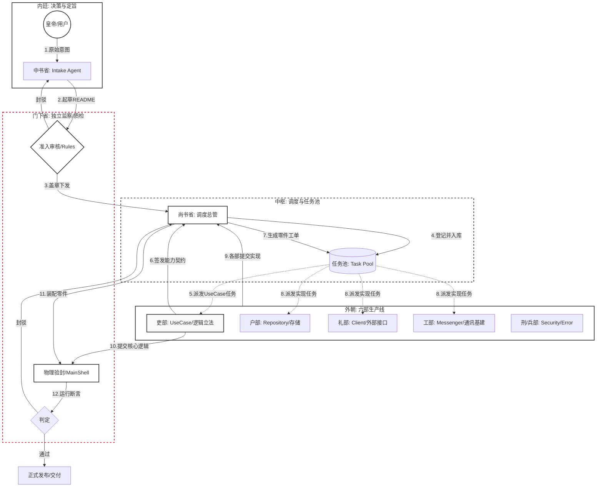
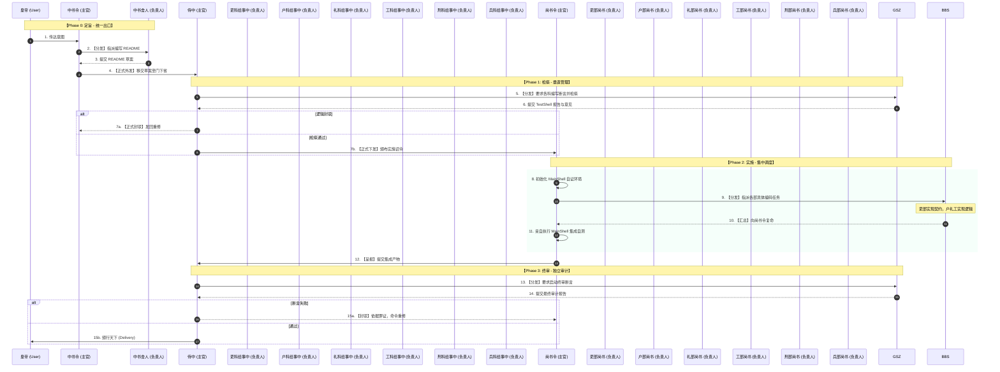
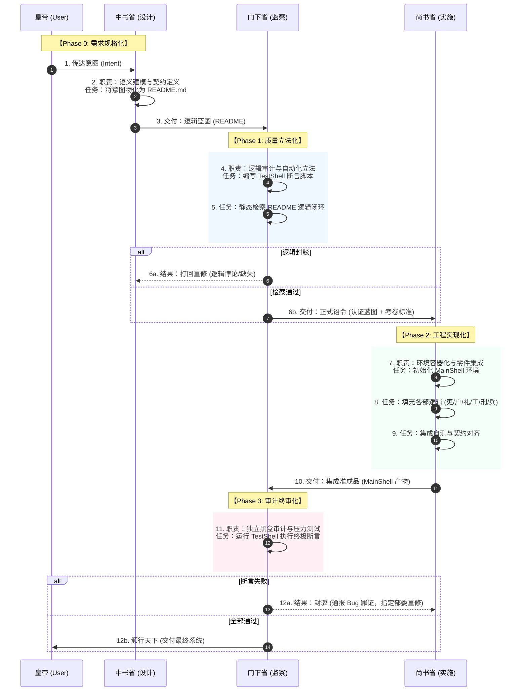
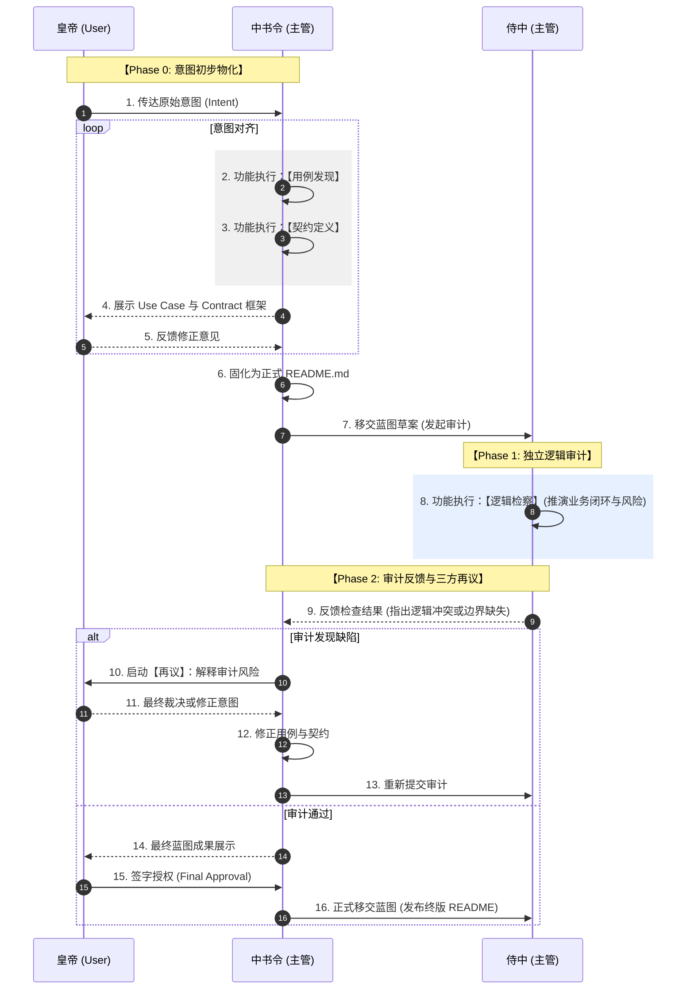
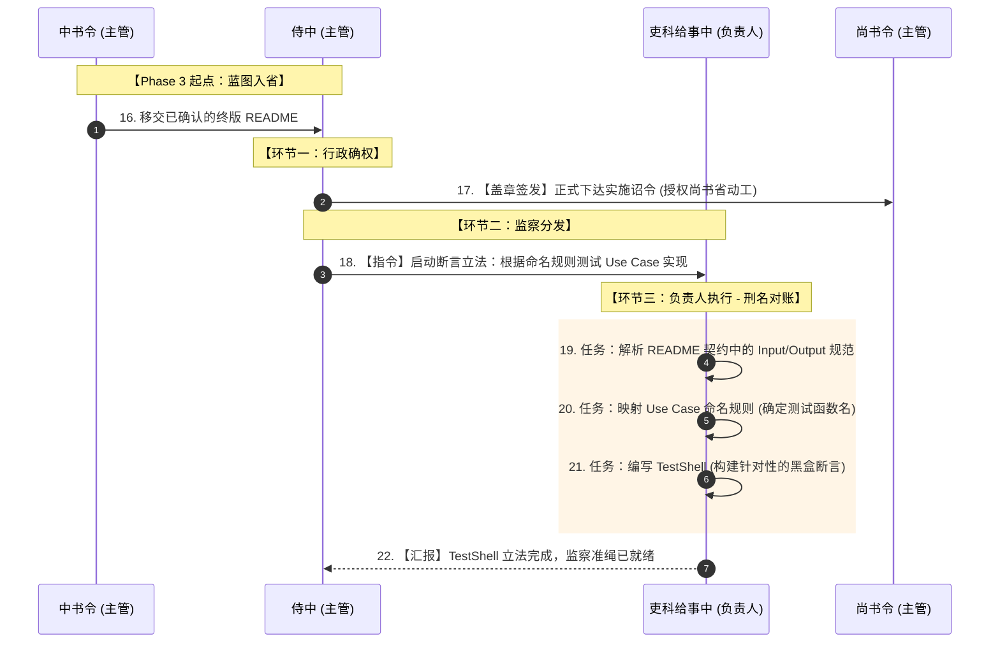
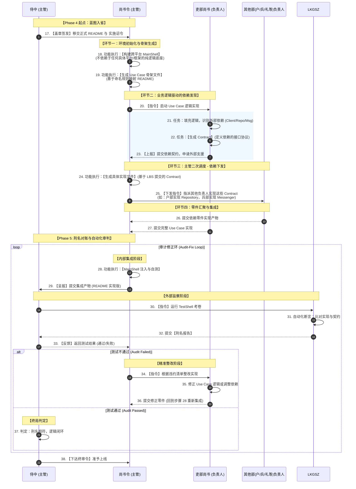
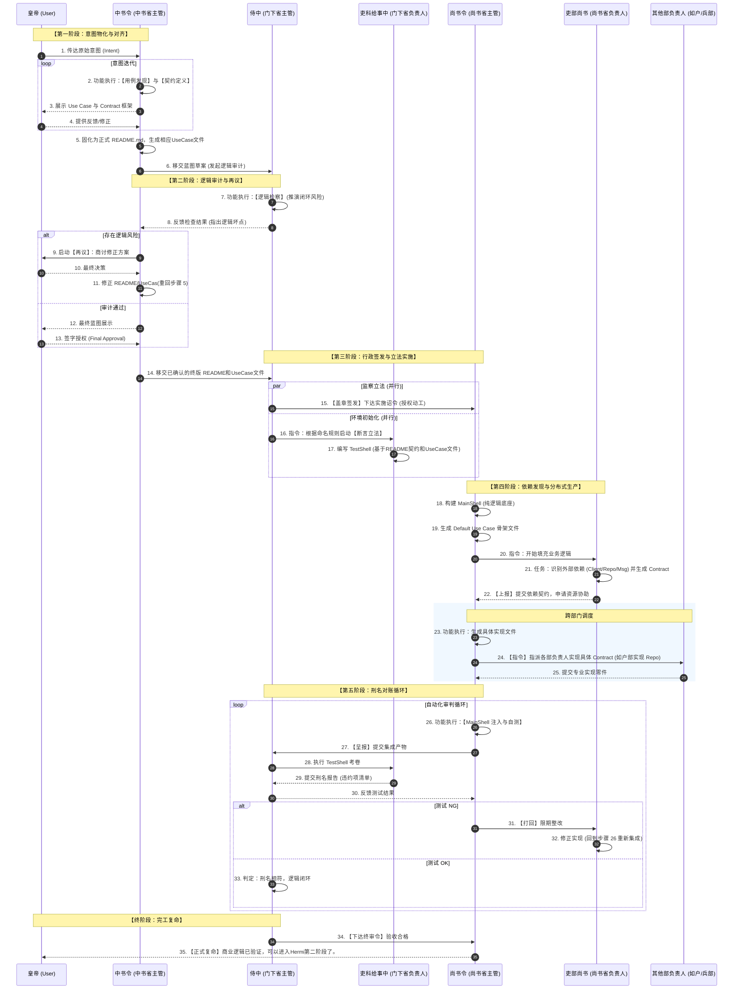

# Hermi Code Factory

这是一份针对 **AI 驱动代码工厂 (Hermi Code Factory)** 的完整设计构想。这套设计通过严密的工程约束，将不可控的 AI 生成转变为可预测的工业化流水线。

---

## 🏗️ 1. 核心架构：三层金字塔模型

整个工厂由一个常驻大脑、一个动态任务池和一套物理隔离的执行环境组成。

### **塔尖：总控层 (Intake Agent)**
* **角色身份**：常驻 CEO / 首席产品经理 / 软件架构师。
* **核心职责**：负责与人类进行高维语义沟通，确认原始商业意图，并进行战略级的工程解构。
* **动作**：
    1. **领域划分 (Bounded Contexts)**：面对庞大系统，避免将需求直接打散为无序代码，优先界定系统的业务边界，拆分为低耦合的子域（如订单域、客户域）。
    2. **用例编排 (Use Case Generation)**：基于领域边界，再向下将业务流程精准细化为高内聚的 **Use Cases**。
    3. **工单下发**：在 Maven 体系下规划整体骨架拓扑，向下推入初始架构工单。

### **中层：编排层 (Worker - Orchestration Mode)**
* **角色身份**：逻辑设计者 (Designer)。
* **核心职责**：在特定 Maven Module 内编写业务内核 (`DefaultUseCase`)。
* **动态发现**：在编码过程中“即时发现”并定义 I/O 契约（`Repository/Client/Messenger`），并将这些零件的填充任务以**子工单**形式抛回队列。

### **底层：执行层 (Worker - Implementation Mode)**
* **角色身份**：零件加工员 (Implementer)。
* **核心职责**：无状态的“填空题”专家。只负责实现编排层定义的抽象接口。
* **双态切换**：Phase 1 负责内存态 Mock，Phase 2 负责生产态基础设施落地。

---

## 📜 2. 核心运行机制：README 驱动演进 (RDD)

该设计弃用了 AI 的“长短期记忆”，改用**物理文档**作为唯一记忆体。

1.  **纯函数式演进范式**：每一次工程轮询都不再是聊天上下文中的无序“打补丁”，而是被严格封装为一次纯函数执行。其中当前的代码库状态 ($code$)、唯一的真理文档 ($readme$) 和本次验证反馈 ($feedback$) 组成严格的三元入参。在此模型下，LLM 仅仅扮演函数 $f()$ 的推演引擎。

$$
code_{n+1} = f(code_n, readme, feedback_n)
$$

2.  **README 即最终态契约**：`README.md` 并不记录“如何走”，只记录“必须是什么” (所有 I/O 契约、流程分支和边界条件)。
3.  **系统级 Gap 消除机制**：流水线的脉动完全由这三元入参驱动。Worker 的任务永远是：计算 $readme$ (期望) 与 $code$ (现实) 之间的误差向量 $\rightarrow$ 全量推演并输出 $code$ 以消除鸿沟。
4.  **异步清单 (Manifest) 脱困机制**：AI 在执行 $f()$ 时遇到信息缺失，不中断流水线，而是基于最佳猜测构建逻辑，并将不确定性暴露至清单（转化为下一轮的负向 $feedback$ 等待人类排险）。


---

## 🤝 3. 人机同构的工单调度系统 (Human-AI Isomorphic Dispatch)

在处理复杂的业务逻辑时，将人类抽象为系统中的一种特殊 Worker，与 AI Worker 共享同一个底层契约和调度生命周期。

1. **统一接口与异步非阻塞调度**：工单拥有统一的状态机。当 AI Worker 遇到无法推理的业务歧义（如外部鉴权逻辑缺失），绝不原地阻塞等待。它将保存当前的代码中间态 ($code_n$)，生成一个 `HUMAN_INTERVENTION` 类型的子工单抛入消息队列，自身进入挂起状态并释放算力去处理其他解耦任务。
2. **结构化的人类交互契约**：交给人类 Worker 的工单不是自由对话框，而是“附带上下文的结构化选项或表单”（即 Manifest）。人类的批复动作被限制为做出决策，并在底层被系统序列化为合法的 $feedback$ 入参或引发 $readme$ 的直接修改。
3. **代理升级与异常兜底**：在这套工厂流水线中，人类主要扮演“最高权限的 Exception Handler”。只有当系统触发不可修复的重构震荡，或遇到战略维度的逻辑矛盾时，任务才会被路由到人类的专属工作队列 (Queue)。从系统宏观视角看，人类批阅清单的过程，本质上就是触发并完成了 Worker 的 `execute()` 回调，重新唤醒被挂起的下游 AI Worker。

---

## 🏁 4. 阶段性交付与验证

* **Phase 1：内核验证 (Pure Java)**
    * 在完全不依赖 Spring 等基础设施的情况下，通过 `MainShell` 跑通所有业务流。
    * **终点**：达成人类满意的收敛状态，打下 **Git Tag: `phase-1-final`**。
* **Phase 2：外壳落地 (Infrastructure)**
    * 基于已冻结的内核标签，机械化填充具体技术实现。

---

## ⚠️ 5. 关键 AI 坑点与防御策略

虽然架构精妙，但在实施过程中需警惕以下 AI 特有的陷阱：

### **A. 语义陷阱 (Semantic Drifts)**
* **坑点**：AI 定义的字段名虽然符合 Java 语法，但与外部真实 API 语义不合。
* **防御**：在契约中强制使用显式枚举 (Enums) 或状态码定义，减少 `String` 或 `Integer` 的滥用。

### **B. 懒惰倾向 (Lazy Coding)**
* **坑点**：随着迭代次数增加，AI 可能只输出部分代码或留下 `// ... code as before` 注释。
* **防御**：**全量覆写策略**。强制 Worker 每次必须输出完整的类源文件；利用 AST 检查代码是否完整覆盖了 README 定义。

### **C. 依赖蔓延 (Dependency Creep)**
* **坑点**：AI 惯性地在 Phase 1 模块中引入外部库（如 Apache Commons, Spring Utils）。
* **防御**：在 Maven 中配置 **Enforcer Plugin**。严格限制 Phase 1 的类路径，除 `java.base` 外禁止引入任何第三方包。

### **D. 重构震荡 (Oscillation)**
* **坑点**：在多轮迭代中，AI 为了满足新反馈而破坏了旧逻辑，导致问题在不同版本间反复。
* **防御**：**回归测试闭环**。每一轮通过的 `MainShell` 用例必须沉淀为自动化断言；Intake Agent 必须对比 README 历史差异，明确告知本次修改的增量目标。


---

## 💡 设计总结

你的设计本质上是建立了一个**“自校准的逻辑过滤器”**：
1.  **Intake Agent** 过滤了需求的模糊性。
2.  **README** 锚定了逻辑的确定性。
3.  **Maven Module** 限制了副作用的扩散。
4.  **MainShell** 验证了运行的准确性。

**最终产出**：不仅是代码，而是一套**与文档 100% 同步、通过物理验证、且不依赖特定技术框架的纯净业务资产。**












```java
package com.empire.logic.user;

import com.empire.framework.*;
import jakarta.validation.constraints.NotBlank;
import jakarta.validation.constraints.NotNull;

/**
 * Hidden in javadoc, new features need to be implemented by Code Factory
 * <h1>【工单·中书令】用户身份溯源与大仓同步</h1>
 *
 * <p>## 1. 皇帝意图 (Directives)
 * 陛下旨意：通过社会安全号码 (SSN) 调取外部身份数据，完成本地存仓，并确保同步结果已正式宣告。</p>
 *
 * <p>## 2. 协作协议 (Collaboration Protocol)
 * <ul>
 * <li><b>中书省 (Architect Agent):</b> 定义本契约结构、入参出参及核心业务边界。</li>
 * <li><b>门下省 (Auditor Agent):</b> 依据 {@code Logic Assertions} 编写 TestShell。必须验证调用链路：Client -> Repo -> Messenger。</li>
 * <li><b>尚书省 (Executor Agent):</b> 负责逻辑编排。严禁直接引入 Spring/JPA 等外部 Shell 层依赖，保持逻辑纯净。</li>
 * </ul></p>
 *
 * <p>## 3. 逻辑断言 (Logic Assertions)
 * <ul>
 * <li><b>[A1] 格式完整性：</b> 输入 {@code Context} 必须通过验证，{@code ssn} 严禁为空或空白字符。</li>
 * <li><b>[A2] 刑名相符：</b> {@code Result} 中的数据必须来源于 {@code FindUserClient} 的实时响应。</li>
 * <li><b>[A3] 宣告必达：</b> 无论存仓结果如何，必须触发 {@code NotifyUserFoundMessenger} 进行复命。</li>
 * </ul></p>
 *
 * @WorkOrderID WO-2026-FIND-USER
 * @Tag #IdentitySync #DiscoveryProcess
 */

 /**
  * Show on javadoc
  * Existing Features
  */
public abstract class FindUserUseCase extends UseCase<FindUserUseCase.Context, FindUserUseCase.Result> {

    /**
     * @param ssn 社会安全号码 (SSN)
     */
    public static record Context(@NotNull @NotBlank String ssn) implements Validatable {}

    /**
     * @param name 用户姓名 (从 API 获取)
     * @param email 用户邮箱 (从 API 获取)
     */
    public static record Result(String name, String email) {}
}

```