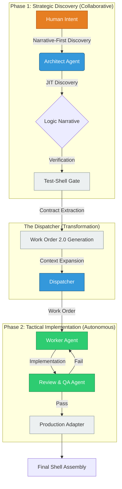

# Hermi: AI-Native Software Factory

Hermi is more than a Java framework; it is an **Engineering Standard** purpose-built for the AI era. By enforcing **Blueprint-First Orchestration**, Hermi transforms traditional development into a predictable, scalable, and autonomous **AI Software Factory**.

## 1. The Core Philosophy: Intent-Driven Factory

Traditional development (Bottom-Up, Depth-First) fails in AI collaboration because of context rot and fragmented logic. Hermi solves this by adopting a **Strategic Intent Sweep** strategy:

*   **Phase 1: Strategic Discovery (Blueprint-First)**
    *   **Goal**: Define "What" the system does.
    *   **Process**: Human-AI collaboration using **Narrative-First Discovery**.
    *   **Output**: A verified **Core Blueprint** (Orchestration logic + I/O Contracts).

*   **Phase 2: Tactical Implementation (Parts-Later)**
    *   **Goal**: Define "How" the system delivers.
    *   **Process**: Autonomous execution by specialized **AI Agent Pools**.
    *   **Output**: Production-ready **Shell Adapters**.

---

## 2. The Implementation Pipeline

The transition from Phase 1 to Phase 2 is managed by a **Dispatcher** that generates high-precision **Work Orders (2.0)**.



---

## 3. Work Order: The Blueprint for Agents

To minimize AI hallucinations and technical debt, the Dispatcher generates structured **Work Orders** for each discovered I/O contract.

### Key Specifications:
1.  **Constraint Diffusion**: Automatically propagates `@Validatable` constraints (e.g., `@NotBlank`, `@Size`) from the Core Contract to the implementation (e.g., SQL DDL or API DTO).
2.  **Doc-Aware Context**: JIT retrieval of external documentation (OpenAPI, Swagger, Database Schemas) attached to the prompt.
3.  **Semantic Error Mapping**: A predefined mapping table of technical exceptions (e.g., `404 Not Found`) to business exceptions (e.g., `UserNotFoundException`).

### Example Work Order (YAML):
```yaml
Work_Order_ID: WO-USER-SAVE-001
Agent_Specialty: RepoAgent
Target_Contract: org.hermi.user.SaveUserRepository
Technology: Spring Data JPA (PostgreSQL)

Mapping_Logic:
  - Context.ssn -> Entity.social_security_number (Unique, Indexed)
  - Result.id -> Entity.id (Primary Key)

Constraint_Diffusion:
  - context.name: NotBlank, Max(50) -> SQL: VARCHAR(50) NOT NULL

Error_Mapping:
  - Database_Error(23505) -> Business_Exception(UserAlreadyExistsException)

Verification_Criteria:
  - Must pass: SaveUserRepositoryIntegrationTest.java
```

---

## 4. Specialized Agent Pool & Dual-Phase Verification

Hermi categorizes implementation tasks into three specialized streams, ensuring that each Agent is a master of its domain.

### Specialized Streams:
*   **RepoAgent**: Expert in SQL, NoSQL, indexing, and transaction management.
*   **ClientAgent**: Expert in REST/gRPC, retry policies, and protocol transformation.
*   **MsgAgent**: Expert in Kafka/RabbitMQ, partitioning, and schema consistency.

### Dual-Phase Verification Model:
1.  **Worker Phase (Construction)**: The specialized agent implements the adapter based on the Work Order.
2.  **Reviewer Phase (Auditing)**: 
    *   **Review Agent**: Checks for technical leakage (e.g., ensuring no business logic exists in the adapter).
    *   **Test-Shell Agent**: Automatically writes and executes an integration test against a local container/simulator to prove the adapter works.

---

## 5. Engineering Advantage: Context Isolation

The superpower of the Hermi AI Factory is **Context Isolation**. 

| Capability | Impact on AI Collaboration |
| :--- | :--- |
| **Sandbox Tasks** | Agents work in isolated sandboxes with <2k tokens of context. High accuracy, low cost. |
| **One-Way Dependency** | Shell depends on Core, but Core knows nothing of Shell. Zero circular dependency rot. |
| **JIT Contract Discovery**| Prompts are generated exactly when needs arise, matching the "Flow" of development. |
| **Deterministic Verification**| High-level logic is proven BEFORE implementation, reducing the blast radius of AI errors. |

> [!IMPORTANT]
> **Summary**: By transforming "Coding" into "Blueprint Verification" and "Part Assembly," Hermi enables a single Human Architect to lead a swarm of AI Agents with the precision of a high-tech manufacturing line.
