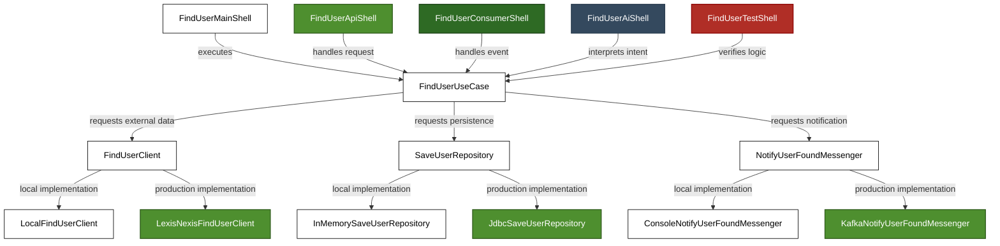

# Hermi: Intent-Driven Architecture

Hermi is a lightweight, opinionated framework for building Java applications where business intent is protected from infrastructure complexity. It transforms the way we build systems by shifting the focus from data-processing to **Intent-Driven Execution**.

> [!NOTE]
> **The Hermi Manifesto**: In Hermi, you are driving an **Action** within a specific **Context** to achieve a definitive **Result**. This semantic focus on **Intent-Driven Architecture** is our cornerstone: we protect the **Intent**, we ignore the Delivery.

By enforcing a strict boundary between execution intent and infrastructure delivery, Hermi ensures your system remains:
- **Independent of Delivery Layers**: Swap a Web API for a CLI, a Kafka Consumer, or an AI MCP server without touching a single line of business logic.
- **Independent of Frameworks**: Treat Spring, Quarkus, or Micronaut as tools, not constraints. 
- **Independent of Persistence**: Business actions know nothing about SQL or NoSQL; they only specify state intentions.
- **100% Testable**: Verify the most complex business scenarios in milliseconds using stateful local adapters—no mocks, no databases, no network.

## Table of Contents
1. [Core Philosophy](#1-core-philosophy)
2. [Architectural Responsibilities](#2-architectural-responsibilities)
3. [The Discovery Lifecycle](#3-the-discovery-lifecycle)
4. [Progressive Tutorial: Realizing the Discovery](#4-progressive-tutorial-realizing-the-discovery)
5. [Naming Conventions](#5-naming-conventions)
6. [Validation Rules](#6-validation-rules)
7. [Project Structure](#7-project-structure)


## 1. Core Philosophy

The framework is built on a single, uncompromising principle: **The Use Case is the Sovereign of the domain.** Everything else — databases, APIs, message brokers — is subordinate. We maintain this sovereignty through **The Three Pillars of Integrity**:

1. **Boundary Integrity**: Strict physical separation via Maven modules. The Use Case is pure Java and knows absolutely nothing of the infrastructure; Localized domain models (**Scoped Models**) ensure the Core remains independent and evolves without friction.
2. **Protocol Integrity**: Mandatory validation on every boundary crossing. Data entering the Core via `Context` or returning as a `Result` is strictly policed by the `Validatable` contract. 
3. **Semantic Integrity**: Rigid naming conventions (**Action-Resource**, **Notify-Fact**) and Just-In-Time (JIT) contract discovery ensure the code is a precise mirror of the business intention, preventing technical "bleed" into the mental model.

**Key Tenets:**
- **Intent-Driven Discovery**: Contracts are defined *exactly* when business logic reveals a need — never before.
- **Empirical Proof (No Mocks)**: Verification uses stateful, technology-agnostic **Main Shells**, proving logic against real-world state transitions rather than fragile mocks.

## 2. Architectural Responsibilities

The framework divides your application into two distinct, non-overlapping domains:

- **Use Case (The Core)**: Dictates _**What**_ the system does. This layer owns **Context** validation, business rules, **Action** orchestration, and domain models. 
- **Shell (The Infrastructure)**: Dictates _**How**_ the system does it. Opting for specific technologies, vendors, or frameworks (e.g., Spring Data JPA, REST clients, Kafka) to implement the I/O contracts defined by the Use Case.

> [!IMPORTANT]
> The Use Case knows absolutely nothing about the Shell. The Shell depends entirely on the contracts defined by the Use Case.

## 3. The Discovery Lifecycle

In Hermi, we avoid speculative design. We follow a **Discovery Lifecycle** where the business logic *reveals* its needs, and the infrastructure simply fulfills that revelation.

### Blueprint-First Orchestration

Phase 1 follows a **Blueprint-First Orchestration** (Top-Down, Breadth-First traversal). Instead of drilling into implementation details, you focus on completing the **holistic orchestration** of the business intent first.

This **Narrative-First Discovery** approach ensures that the business intent remains the source of truth. The engineer begins by defining the **Context** and the **Result** of the action. From this boundary, the orchestration logic is written as a complete narrative, treating collaborators as if they already exist. External dependencies — for retrieval, persistence, or notification — are only formalized at the exact moment the business logic reveals a need for them.

In Hermi, **we build the 'whole' (The Blueprint) before the 'details' (The Implementation)**: the business logic drives the discovery of its dependencies, ensuring the architecture remains a pure reflection of intent.

### Phase 1: Discovery & Verification (The Core)

Phase 1 is about revealing and proving the system's behavior. We answer _"What"_ the system does using exclusively pure Java:

1. **Establish the Boundary**: Define your `UseCase` contract (`Context` and `Result`).
2. **Initialize Core Implementation**: Create a skeletal `DefaultUseCase` class.
3. **The Main Shell**: Build a minimal Java `main` execution environment as a "Play Button" for continuous validation.
4. **JIT I/O Discovery**: Write logic; define I/O contracts the moment a specific behavior is revealed, categorizing them by architectural intent (Client, Repository, or Messenger).
5. **Holistic Orchestration**: Finalize the narrative flow between the discovered I/O contracts.
6. **The Phase 1 Gate**: Verify the logic against real-world state transitions in the Main Shell. Phase 1 is complete when all intents are proven.

### Phase 2: Realization & Delivery (The Shell)

Phase 2 is about materializing the discovered intents. We answer _"How"_ the system delivers value by mapping contracts to specific technologies:

7. **Implement Production Adapters**: For each I/O contract discovered in Phase 1, build the technology-specific adapter (e.g., `JdbcUserRepository`).
8. **Expose via Entry Points**: Wire the adapters into the chosen delivery mechanism (e.g., REST Controller, Kafka Consumer, or AI MCP Server).

## 4. Progressive Tutorial: Realizing the Discovery

The following tutorial demonstrates the implementation of a Use Case step-by-step. By the end, you will have a complete, fully testable Use Case with three I/O contracts — all verified in isolation before a single line of infrastructure is written.

**Scenario**: We want to build a feature to retrieve a user by their SSN from a 3rd-party API, save them to a local database, and publish a notification.

### Phase 1: Use Case (The Core)

#### Step 1: Establish the Boundary
Everything starts with defining the exact context (`Context`) and result (`Result`) representing the Use Case.

> [!WARNING]
> Data entering the Use Case boundary **MUST** implement the `Validatable` interface.

> [!NOTE]
> `Validatable` is not just a marker. The framework's base `execute()` method automatically invokes validation on any `Validatable` context before ever delegating to your `doExecute()` core logic. Your business logic is guaranteed to receive safe data.

```java
public abstract class FindUserUseCase extends UseCase<FindUserUseCase.Context, FindUserUseCase.Result> {
    public static record Context(@NotNull @NotBlank String ssn) implements Validatable {}
    public static record Result(String name, String email) {}
}
```

#### Step 2: Skeletal Implementation
Establish the core Use Case implementation. Initially, it simply defines a local domain model scoped strictly to this logic.

```java
/** Domain Model scoped strictly to this use case. */
public record User(String ssn, String name, String email) {}

public class DefaultFindUserUseCase extends FindUserUseCase {
    @Override
    protected Result doExecute(Context context) {
        // Business logic goes here
        return new Result(null, null);
    }
}
```

#### Step 3: The Execution Harness: Pure Java Main Shell
Establish the execution harness to enable continuous execution and debugging during development. By using a standard `public static void main` method, we completely avoid external framework dependencies (like JUnit) in Phase 1, keeping the core purely Java.

```java
public class FindUserMainShell {
    public static void main(String[] args) {
        var useCase = new DefaultFindUserUseCase();
        
        // Execute this locally to verify the logic
        var result = useCase.execute(new FindUserUseCase.Context("123-456-789"));
        System.out.println("Result: " + result);
    }
}
```

#### Step 4: Just-In-Time Discovery (Fetching the User)
When the core logic requires external data retrieval, do not implement a protocol-specific client (e.g., HTTP). Instead, define a pure Java contract tailored precisely to the required data.

```java
// Define the required client contract:
public abstract class FindUserClient extends Client<FindUserClient.Context, FindUserClient.Result> {
    public record Context(String ssn) {}
    public record Result(String name, String email) implements Validatable {}
}
```

Inject this contract into the Use Case to process the external data:

```java
public class DefaultFindUserUseCase extends FindUserUseCase {
    private final FindUserClient findUserClient;

    public DefaultFindUserUseCase(FindUserClient findUserClient) {
        this.findUserClient = findUserClient;
    }

    @Override
    protected Result doExecute(Context context) {
        // 1. Fetch user data via the client contract
        var apiResult = findUserClient.execute(new FindUserClient.Context(context.ssn()));
        var user = new User(context.ssn(), apiResult.name(), apiResult.email());
        
        return new Result(user.name(), user.email());
    }
}
```

#### Step 5: Just-In-Time Discovery (Saving the User)
When the logic requires data persistence, define a repository contract.

```java
// Define the required repository contract:
public abstract class SaveUserRepository extends Repository<SaveUserRepository.Context, SaveUserRepository.Result> {
    public record Context(String name, String email) {}
    public record Result(String id) implements Validatable {}
}
```

Update the Use Case orchestration to implement the persistence flow:

```java
public class DefaultFindUserUseCase extends FindUserUseCase {
    private final FindUserClient findUserClient;
    private final SaveUserRepository saveUserRepository;

    public DefaultFindUserUseCase(FindUserClient findUserClient, SaveUserRepository saveUserRepository) {
        this.findUserClient = findUserClient;
        this.saveUserRepository = saveUserRepository;
    }

    @Override
    protected Result doExecute(Context context) {
        var apiResult = findUserClient.execute(new FindUserClient.Context(context.ssn()));
        var user = new User(context.ssn(), apiResult.name(), apiResult.email());
        
        // 2. Save the user via the repository contract
        saveUserRepository.execute(new SaveUserRepository.Context(user.name(), user.email()));
        
        return new Result(user.name(), user.email());
    }
}
```

#### Step 6: Just-In-Time Discovery (Sending Notification)
If an outbound event is required upon completion, define a messenger contract and finalize the orchestration.

```java
// Define the required messenger contract:
public abstract class NotifyUserFoundMessenger extends Messenger<NotifyUserFoundMessenger.Context, NotifyUserFoundMessenger.Result> {
    public record Context(String email, String message) {}
    public record Result(String messageId) implements Validatable {}
}
```

#### Step 7: Holistic Orchestration
Once the individual I/O intents are discovered, the Use Case orchestration is finalized:

```java
public class DefaultFindUserUseCase extends FindUserUseCase {
    private final FindUserClient findUserClient;
    private final SaveUserRepository saveUserRepository;
    private final NotifyUserFoundMessenger messenger;

    public DefaultFindUserUseCase(FindUserClient findUserClient, 
                                  SaveUserRepository saveUserRepository, 
                                  NotifyUserFoundMessenger messenger) {
        this.findUserClient = findUserClient;
        this.saveUserRepository = saveUserRepository;
        this.messenger = messenger;
    }

    @Override
    protected Result doExecute(Context context) {
        // 1. Fetch user data
        var apiResult = findUserClient.execute(new FindUserClient.Context(context.ssn()));
        var user = new User(context.ssn(), apiResult.name(), apiResult.email());
        
        // 2. Save user
        saveUserRepository.execute(new SaveUserRepository.Context(user.name(), user.email()));
        
        // 3. Send notification
        var notificationContext = new NotifyUserFoundMessenger.Context(user.email(), "User found: " + user.name());
        messenger.execute(notificationContext);
        
        return new Result(user.name(), user.email());
    }
}
```

#### Step 8: The Phase 1 Gate (Verification)
With the orchestration complete, verify all boundary and edge cases. Unlike mocking frameworks which couple tests to implementation details, state-backed local adapters prove your logic handles real-world state transitions.

> [!TIP]
> Maintaining local abstractions (e.g., in-memory repositories) for every use case can feel heavy. The `hermi-shell` project provides pre-built, reusable local adapters and utilities to significantly reduce this boilerplate.

```java
// 1. A stateful in-memory repository (Simple Implementation)
class InMemorySaveUserRepository extends SaveUserRepository {
    public final Map<String, String> db = new HashMap<>(); // Standard Java Map for state

    @Override
    protected Result doExecute(Context context) {
        db.put(context.email(), context.name());
        return new Result("id-001");
    }
}
 
// 2. A simple console-logging messenger
class ConsoleNotifyUserFoundMessenger extends NotifyUserFoundMessenger {
    @Override
    protected Result doExecute(Context context) {
        System.out.println("[Notification] To: " + context.email() + ", Msg: " + context.message());
        return new Result("msg-123");
    }
}
 
// 3. A programmable local client
class LocalFindUserClient extends FindUserClient {
    private Result result = new Result("John Doe", "john@example.com");

    public void setResult(Result result) { this.result = result; }

    @Override
    protected Result doExecute(Context context) {
        return result;
    }
}
```
```java
public class FindUserMainShell {
    public static void main(String[] args) {
         var client = new LocalFindUserClient(); 
        var repo = new InMemorySaveUserRepository();
        var messenger = new ConsoleNotifyUserFoundMessenger();
        
        var useCase = new DefaultFindUserUseCase(client, repo, messenger);
        var result = useCase.execute(new FindUserUseCase.Context("123-45-6789"));
        
        if (result == null) throw new AssertionError("Result cannot be null");
        System.out.println("✅ Happy Path Verified: " + result.name());
    }
}
```

### Phase 2: Building the Shell (Example: Spring Boot)

#### Step 9: Realizing the Shell (Production Adapters)
With Phase 1 complete and the core logic verified, build a technology-specific adapter class for each I/O contract discovered in Phase 1.

```java
@Component
public class LexisNexisFindUserClient extends FindUserClient
    implements ClientAdapter<ApiRequest, ApiResponse, FindUserClient.Context, FindUserClient.Result> {

  private RestTemplate restTemplate;

  @Override
  protected Result doExecute(Context context) {
    ApiRequest apiRequest = convertContext(context);
    ApiResponse apiResponse = process(apiRequest);
    return convertResult(apiResponse);
  }

  @Override
  public ApiRequest convertContext(Context context) {
    return new ApiRequest(context.ssn());
  }

  @Override
  public ApiResponse process(ApiRequest input) {
    return restTemplate.postForObject("/api/users", input, ApiResponse.class);
  }

  @Override
  public Result convertResult(ApiResponse result) {
    return new Result(result.getName(), result.getEmail());
  }
}

@Component
public class JdbcSaveUserRepository extends SaveUserRepository
    implements RepositoryAdapter<UserEntity, UserEntity, SaveUserRepository.Context, SaveUserRepository.Result> {

  private final UserJpaRepository jpaRepository;

  public JdbcSaveUserRepository(UserJpaRepository jpaRepository) {
    this.jpaRepository = jpaRepository;
  }

  @Override
  protected Result doExecute(Context context) {
    UserEntity entity = convertContext(context);
    UserEntity savedEntity = process(entity);
    return convertResult(savedEntity);
  }

  @Override
  public UserEntity convertContext(Context context) {
    return new UserEntity(context.name(), context.email());
  }

  @Override
  public UserEntity process(UserEntity entity) {
    return jpaRepository.save(entity);
  }

  @Override
  public Result convertResult(UserEntity entity) {
    return new Result(entity.getId());
  }
}

@Component
public class KafkaNotifyUserFoundMessenger extends NotifyUserFoundMessenger
    implements MessengerAdapter<ProducerRecord<String, String>, RecordMetadata, NotifyUserFoundMessenger.Context, NotifyUserFoundMessenger.Result> {

  private final KafkaTemplate<String, String> kafkaTemplate;

  public KafkaNotifyUserFoundMessenger(KafkaTemplate<String, String> kafkaTemplate) {
    this.kafkaTemplate = kafkaTemplate;
  }

  @Override
  protected Result doExecute(Context context) {
    ProducerRecord<String, String> record = convertContext(context);
    RecordMetadata metadata = process(record);
    return convertResult(metadata);
  }

  @Override
  public ProducerRecord<String, String> convertContext(Context context) {
    return new ProducerRecord<>("user.notifications", context.message());
  }

  @Override
  public RecordMetadata process(ProducerRecord<String, String> record) {
    try {
      return kafkaTemplate.send(record).get().getRecordMetadata();
    } catch (Exception e) {
      throw new RuntimeException(e);
    }
  }

  @Override
  public Result convertResult(RecordMetadata metadata) {
    return new Result(metadata.toString());
  }
}
```

#### Step 10: Final Delivery (Entry Points)
Wire the production adapters into the appropriate entry point for your Shell. The exact mechanism depends on the chosen framework. In this Spring Boot example, a `@RestController` is used, with an intermediate `@Service` layer to support `@Transactional`. If no cross-cutting concerns are required, the `DefaultFindUserUseCase` can be wired directly into the entry point without a dedicated Service class. Other Shell implementations (e.g., Quarkus, CLI runners, message consumers, AI MCP servers) will differ in their wiring approach, but the Use Case core remains unchanged.

```java
@Service
@Transactional
public class FindUserService {
    private final FindUserUseCase findUserUseCase;

    @Autowired
    public FindUserService(LexisNexisFindUserClient client, 
                           JdbcSaveUserRepository repo, 
                           KafkaNotifyUserFoundMessenger messenger) {
        // Instantiate the Use Case with production adapters
        this.findUserUseCase = new DefaultFindUserUseCase(client, repo, messenger);
    }

    public FindUserUseCase.Result findUser(FindUserUseCase.Context context) {
        return findUserUseCase.execute(context);
    }
}
```

```java
@RestController
@RequestMapping("/users")
public class FindUserApiShell {
    private final FindUserService findUserService;

    @Autowired
    public FindUserApiShell(FindUserService findUserService) {
        this.findUserService = findUserService;
    }

    @GetMapping
    public FindUserUseCase.Result findUser(@RequestBody FindUserUseCase.Context context) {
        return findUserService.findUser(context);
    }
}
```

Alternatively, for event-driven architectures, you can expose the Use Case via a message-driven entry point. In this example, a Spring `@KafkaListener` processes requests from an inbound topic by delegating to the `FindUserService`.

```java
@Component
public class FindUserConsumerShell {
    private final FindUserService findUserService;

    @Autowired
    public FindUserConsumerShell(FindUserService findUserService) {
        this.findUserService = findUserService;
    }

    @KafkaListener(topics = "user.find.requests", groupId = "user-service-group")
    public void consume(String ssn) {
        FindUserUseCase.Context context = new FindUserUseCase.Context(ssn);
        findUserService.findUser(context);
    }
}
```


## 5. Naming Conventions

### The Core Logic: Functional Soul in an OOP Body
Strictly adhering to these naming rules is not just about aesthetics; it is about preserving the **Economic and Semantic Integrity** (as defined in Section 1) of the architecture.

- **Functional Soul**: Though implemented as Classes (to preserve type metadata for validation), every Client, Repository, and Messenger is a Function at heart. Every component is an **Executor** with a single `execute()` entry point.
- **Temporal Modeling**: We model the codebase after Time and Tense.
  - Action (Future/Present): Client, Repository, and Messenger reflect an Intention (e.g., Find, Save, Notify).
- **Just-In-Time (JIT) Discovery**: Contracts are never designed upfront based on "what the database can do." They are discovered exactly when the business logic reveals a specific need.

### 1. Phase 1: Use Case Layer (Core Logic)
Pure Java, technology-neutral business logic.

| Component | Naming Pattern | Example |
| :--- | :--- | :--- |
| **UseCase** | `{Action}{Resource}UseCase` | `FindUserUseCase` |
| **I/O: Client** | `{Action}{Resource}Client` | `FindUserClient` (Initiating Action) |
| **I/O: Repository** | `{Action}{Resource}Repository` | `SaveUserRepository` (Initiating Action) |
| **I/O: Messenger** | **`{Notify}{Fact}Messenger`** | `NotifyUserFoundMessenger` (Initiating Action) |
| **Inner Model** | `{Resource}` | `User` (Scoped specifically to the UseCase) |

### 2. Phase 2: Shell Layer (Infrastructure)
Technology-specific implementations (e.g., Spring, JDBC, Kafka).

| Component | Naming Pattern | Example |
| :--- | :--- | :--- |
| **Prod Adapter** | `{Tech/Vendor}{ActualContractName}` | `JdbcSaveUserRepository`, `KafkaNotifyUserFoundMessenger`, `LexisNexisFindUserClient` |
| **Entry Point** | `{Action}{Resource}{Type}Shell` | `FindUserApiShell`, `FindUserConsumerShell` |

### 3. The Three Golden Rules

#### Rule 1: The Tense Integrity
Logic drives the tense. Every I/O component is an **Action** and MUST start with a Verb (Find, Save, Notify). Total execution is performed by a single `.execute()` method within a specific **Context**, yielding a definitive **Result**. 

#### Rule 2: Prefix Isolation
The Core is pure; the Shell is tech-heavy. Any class containing infrastructure (JDBC, Kafka, etc.) MUST have the technology name as its very first word. No prefix means Pure Java.

#### Rule 3: Single Action Prophecy
If you need a new action, you define a new class. Avoid "Utility", "Manager", or "Service" classes that group multiple unrelated behaviors.


## 6. Validation Rules

To protect the **Protocol Integrity** (defined in Section 1) of the application, data crossing boundaries into the Use Case is heavily policed. All entries must be explicitly validated.

> [!NOTE]
> **Validation Philosophy**: In the Hermi Framework, backend input validation acts as a strict contract enforcement. If a validation error is triggered, it serves as an explicit signal to the upstream developer that their client (e.g., a Web UI or Mobile App) is missing necessary validation logic. By failing fast, the framework forces developers to add missing validations directly to the user interface, improving the end-user experience via instant client-side feedback rather than relying on network round-trips.

| Boundary | Interface | Requirement |
| :--- | :--- | :--- |
| **Entering Use Case** | `UseCase.Context` | `implements Validatable` (Mandatory) |
| **Entering Use Case** | `Client.Result` | `implements Validatable` (Mandatory) |
| **Entering Use Case** | `Repository.Result` | `implements Validatable` (Mandatory) |
| **Entering Use Case** | `Messenger.Result` | `implements Validatable` (Mandatory) |
| **Leaving Use Case** | `UseCase.Result` | Optional |
| **Leaving Use Case** | `Client.Context` | Optional |
| **Leaving Use Case** | `Repository.Context` | Optional |
| **Leaving Use Case** | `Messenger.Context` | Optional |


## 7. Project Structure

A pure Java Use Case model coupled with a Framework Shell model dictates a robust multi-module project layout. By breaking the project into strictly separated modules, you physically prevent infrastructure libraries from leaking into business domains.

```text
hermi-user (Parent)
├── pom.xml
│
├── use-cases/hermi-find-user-usecase (Phase 1 Layer: Pure Java)
│   ├── pom.xml
│   ├── src/main/java/org/hermi/user/find/usecase
│   │   ├── FindUserUseCase.java                    (Use Case Contract)
│   │   ├── DefaultFindUserUseCase.java             (Use Case Implementation)
│   │   ├── User.java                               (Scoped Domain Model)
│   │   ├── FindUserClient.java                     (I/O Contract)
│   │   ├── SaveUserRepository.java                 (I/O Contract)
│   │   └── NotifyUserFoundMessenger.java           (I/O Contract)
│   └── src/test/java/org/hermi/user/find/shell
│       ├── FindUserMainShell.java                  (Main Shell Runner)
│       ├── LocalFindUserClient.java                (Local Adapter)
│       ├── InMemorySaveUserRepository.java         (Local Adapter)
│       └── ConsoleNotifyUserFoundMessenger.java    (Local Adapter)
│
└── hermi-spring-shell (Phase 2 Layer: Framework)
    ├── pom.xml
    └── src/main/java/org/hermi/user/find/shell
        ├── FindUserApiShell.java                   (Spring RestController)
        ├── FindUserConsumerShell.java              (Spring KafkaConsumer)
        ├── FindUserService.java                    (Spring Service)
        ├── LexisNexisFindUserClient.java           (Production Adapter)
        ├── JdbcSaveUserRepository.java             (Production Adapter)
        └── KafkaNotifyUserFoundMessenger.java      (Production Adapter)
```
