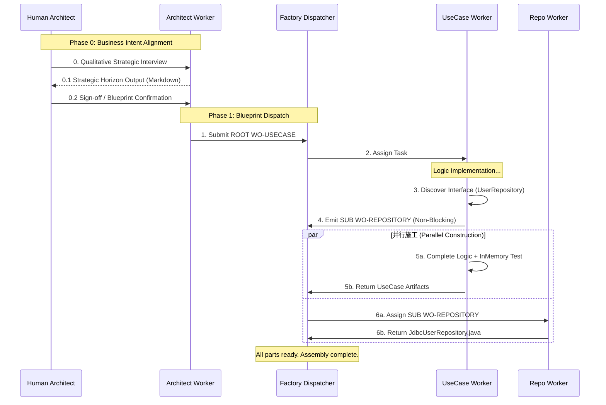

# Recursive AI Software Factory: Hierarchical Work Order Architecture (V3.2 Final)

本方案详述了如何通过**非阻塞、分层递归**的工单机制，实现从“需求扫描”到“组件交付”的自动化闭环。本架构是一套**通用的概念框架 (Conceptual Framework)**，旨在将软件工程转化为确定性的工业流水线。

## 0. 设计理念 (Design Philosophy)

本架构的核心灵魂在于**将软件工程转化为确定性的工业生产**，遵循以下四大原则：

### 双重递归演进引擎 (Dual Recursive Engine)
本工厂的运作受以下两个闭环反馈公式共同驱动：

> [!IMPORTANT]
> **1. 需求演进公式 (Requirement Evolution - Phase 0)**
> **`requirement = f(requirement, new-feature)`**
> - **核心**：发生在访谈对齐阶段。通过 Architect Worker 的深度探测，不断将模糊的意图转化为确定的需求蓝图。
>
> **2. 代码演进公式 (Code Evolution - Phase 1-3)**
> **`code = f(requirement, code, feedback)`**
> - **核心**：发生在生产交付阶段。通过 Worker 的递归施工与测试反馈，不断减少实现代码与需求蓝图之间的“熵值513203008

1.  **意图与实现的分离 (Separation of Intent and Implementation)**：
    *   UseCase 负责“表达意图”（做什么），Adapter 负责“完成实现”（怎么做）。AI 的逻辑深度被严格限制在 UseCase 层，而技术复杂度被剥离到 Adapter 层。
2.  **递归解耦 (Recursive Decomposition)**：
    *   面对复杂的系统，Agent 不尝试一次性理解全部。它通过抛出工单将大问题拆解为原子任务。这种**分而治之**的递归机制是解决 AI 上下文限制（Token Limit）的唯一终极方案。
3.  **以契约为准绳 (Contract-First Orchestration)**：
    *   在 Hermi 工厂中，**接口 (Interface) 是硬通货**。UseCase Agent 只需定义它想要的契约，Dispatcher 就会确保零件的精准交付。这实现了真正的“插拔式”开发。
4.  **逻辑先行验证 (Proof-of-Logic)**：
    *   我们坚持**逻辑必须在内存中被证明正确**。在任何数据库适配器编写之前，业务逻辑必须通过 `InMemory` 测试。这消除了技术噪音带来的不确定性。

### BCE 健壮性分析协议 (ICONIX Robustness Analysis)
本工厂通过 **BCE (Boundary-Control-Entity)** 模型填补“需求访谈”与“代码实现”之间的鸿沟：

| ICONIX 概念 | 工厂映射 (Mapping) | 职责 (Responsibility) |
| :--- | :--- | :--- |
| **Boundary (边界)** | **Shell 层适配器** (Repo, Client) | 外部 IO、数据库、API 交互。 |
| **Control (控制)** | **Core 层 UseCase** | 协调业务逻辑，不持有基础实现。 |
| **Entity (实体)** | **Domain Records** | 系统状态与核心领域数据。 |

> [!TIP]
> **逻辑净纯度守则 (Logic Purity Rule)**：
> 1.  **C 不准直接调 C**：必须通过子任务 (WorkOrder) 实现递归解耦。
> 2.  **C 只能通过 B 访问外部环境**：禁止在 UseCase 中直接编写 HTTP 或 SQL。
> 3.  **不确定性过滤**：如果在对齐阶段无法界定一个对象是 B、C 还是 E，则该需求处于“不收敛”状态，严禁进入生产线。

---

## 1. 方案全景图 (Recursive Architecture)



---

## 2. 发现协议：从混沌到蓝图 (Discovery Protocol)

为了确保 Human Architect 和 Architect Worker 之间的高效同步，我们采用以下三层对齐机制：

### 2.1 战略性探查 (Strategic Probing)
Architect Worker 遵循 **“6-Phase Interview”** 方法论：
- **无抽象对话**：强制要求具体业务实例（Examples）。
- **JIT 契约发现**：在描述流程时，动态识别所需的 I/O 契约，并将其定义为 Interface。

### 2.2 状态黑板模式 (Blackboard Pattern)
双方同步的不是对话内容，而是共享的 **“Strategic Horizon Output”** 看板：
- **边界 (Boundary)**：定义 Core vs External。
- **业务规则 (Rules)**：固化 `IF-THEN` 逻辑。
- **实体映射 (Entities)**：核心状态对象。

---

## 3. 工厂执行标准 (Execution Standards)

### 3.1 工单协议 (WorkOrder-2.0 JSON)
```json
{
  "id": "WO-USER-SAVE-001",
  "type": "REPOSITORY",
  "parent": "WO-ROOT-001",
  "payload": {
    "interface_fqn": "org.hermi.domain.UserRepository",
    "method_signature": "User save(User user)",
    "rules": ["Unique email constraint", "Transaction required"]
  },
  "deliverables": [
    "src/main/java/org/hermi/shell/JdbcUserRepository.java",
    "src/test/resources/sql/user_table.sql"
  ],
  "verification": {
    "mode": "INTEGRATION_TEST",
    "target_shell": "H2DatabaseShell"
  }
}
```

### 3.2 完工标准 (Definition of Done)
1.  **LOGIC_PROVEN**：UseCase 业务代码 + `InMemory` 测试 100% 通过。
2.  **REALIZED**：所有被抛出的子工单完成交付并过检。
3.  **COMPLETED**：最终集体验证（Integration Test）通过。

---

## 4. 质量保证与缺陷回溯 (QA & Defect Escalation)
 
 > [!CAUTION]
 > **若 Repo Worker 发现接口定义不合理 (Defect Escalation)**：
 > 1.  **提交缺陷报告**：Repo Worker 产生一个 `DEFECT_REPORT` 工单描述技术矛盾。
 > 2.  **上报 Architect**：Dispatcher 将工单路由回 **Architect Worker**。
 > 3.  **人机对齐**：Architect Worker 挂起生产线，拉起与 **Human Architect (你)** 的对话探讨方案。
 > 4.  **重新派单**：根据探讨出的新方案，更新蓝图，进入下一轮迭代。

---

## 5. 实施路径 (Roadmap)

### Phase 0: 业务意图对齐 (Foundational Alignment)
- **核心动作**：Architect Worker 与 Human Architect (你) 进行 6-Phase 深度访谈。
- **产出物**：`Strategic Horizon Output` (地平线看板)。
- **物理门禁 (Gate)**：Human 手动确认 (Sign-off) 后，工厂才允许发出第一张 `WO-USECASE` 工单。

### Phase 1: 基础设施搭建
- 定义 `WorkOrder-2.0` 数据结构。
- 构建 `Dispatcher` 任务分发与状态监听。

### Phase 2: Worker 施工与递归发现测试
- 模拟一个完整的业务场景，验证 UseCase Worker 的“非阻塞契约发现”能力。

---

## 6. 业界前沿模式总结 (Industry Benchmarking)

*   **Executable Specifications**：需求转化为具体的、可自动验证的指标。
*   **Hierarchical Task Network (HTN)**：从复杂目标到原子任务的自动分发与调度。
*   **HITL (Human-in-the-Loop)**：人类不再编写代码，而是通过对蓝图（Blueprint）的确认来驱动生产。
